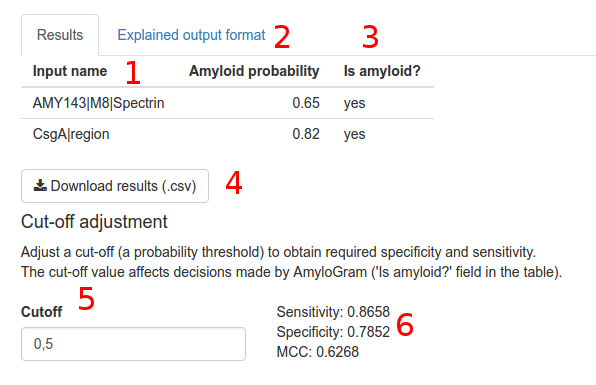

1. Names of the input sequences (if provided). May be sorted alphabetically.
2. Probability of amyloidogenic properties (according to the AmyloGram model). May be sorted.
3. Prediction: is a sequence an amyloid? The prediction is based on the cut-off (see 5).
4. Download results in the .csv format.
5. Cut-off adjustment. The cut-off value must be between 0 and 1. It may be altered to achieve desired specificity or sensitivity.
6. Values of sensitivity, specificity and Matthew's Correlation Coefficient (MCC) for the specified cut-off value.
